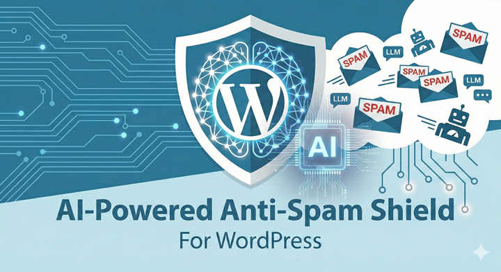
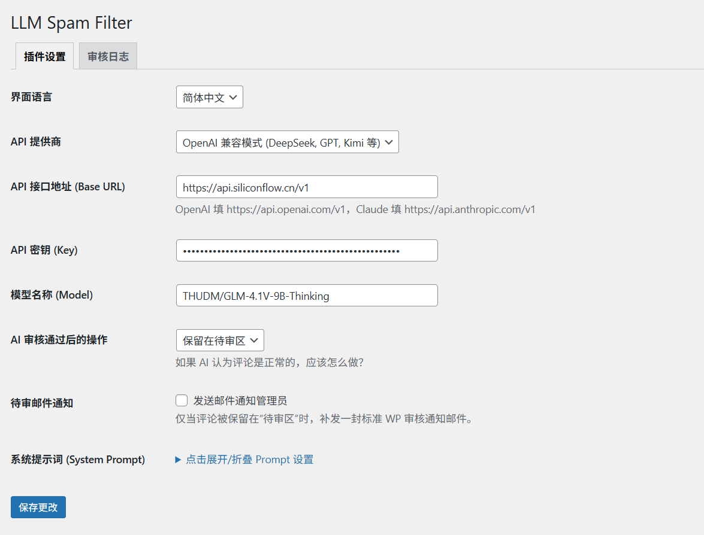
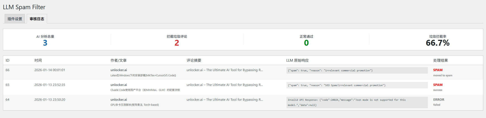

# LLM SPAM Filter



> 基于大语言模型的 WordPress 智能垃圾评论过滤插件

[](https://github.com)
[](https://wordpress.org)
[](LICENSE)

[English](README.md) | [简体中文](README_zh.md)

## 简介

LLM SPAM Filter 是一款利用大语言模型（LLM）API 自动检测和过滤 WordPress 垃圾评论的插件。与传统基于规则或关键词的过滤方式不同，本插件通过 AI 理解评论内容语义，准确识别 SEO 垃圾、无意义机器人评论、钓鱼链接等恶意内容。

## 特性

- **智能 AI 检测** - 利用大语言模型理解评论语义，准确识别垃圾评论
- **异步处理** - 通过 WP-Cron 异步调用 API，不影响用户体验
- **多平台支持** - 支持 OpenAI 兼容 API（DeepSeek、GPT、Kimi 等）和 Anthropic Claude
- **自定义 Prompt** - 灵活配置系统提示词，适配不同场景需求
- **多语言界面** - 支持简体中文、英文界面切换
- **可视化仪表盘** - 直观的统计数据和历史记录
- **灵活处置** - 正常评论可自动批准或保留待审，支持邮件通知

## 安装

### 方法一：手动安装

1. 下载插件文件到 `wp-content/plugins/wp-llm-comment-filter/`
2. 在 WordPress 后台「插件」菜单中启用「LLM SPAM Filter」
3. 前往「设置 > LLM SPAM Filter」进行配置

### 方法二：GitHub 克隆

```bash
cd wp-content/plugins/
git clone https://github.com/yourusername/wp-llm-comment-filter.git
```

然后在 WordPress 后台启用插件。

## 配置

### 1. 获取 API Key

**OpenAI 兼容平台**（以 DeepSeek 为例）：
- 访问 [硅基流动](https://cloud.siliconflow.cn/) 注册账号
- 获取 API Key

**Anthropic Claude**：
- 访问 [Anthropic Console](https://console.anthropic.com/)
- 创建 API Key

### 2. 插件设置

在「设置 > LLM SPAM Filter」中配置：

| 选项 | 说明 |
|------|------|
| API Provider | 选择 OpenAI 兼容或 Claude |
| API Base URL | API 接口地址 |
| API Key | 填入您的 API 密钥 |
| Model Name | 模型名称（如 gpt-4o-mini） |
| Action for Legit | AI 判断为正常评论后的处理方式 |
| System Prompt | 自定义垃圾评论检测提示词 |

### 推荐模型配置

| 提供商 | API Base URL | 模型名称 |
|--------|-------------|----------|
| OpenAI | https://api.openai.com/v1 | gpt-4o-mini |
| DeepSeek | https://api.siliconflow.cn/v1 | deepseek-ai/DeepSeek-V3 |
| Claude | https://api.anthropic.com/v1 | claude-3-5-sonnet-20241022 |

## 工作原理

```
用户提交评论
    ↓
插件拦截评论（管理员除外）
    ↓
创建日志记录，状态为「待处理」
    ↓
通过 WP-Cron 调度异步任务
    ↓
发送评论内容到 LLM API 分析
    ↓
根据 AI 结果：
  - 垃圾评论 → 标记为 spam
  - 正常评论 → 批准 / 保留待审
    ↓
更新日志记录
```

## 使用统计

插件会在「审核日志」页面展示统计数据：

- **AI 分析总量** - 经 AI 检测的评论总数
- **拦截垃圾评论** - 被识别为垃圾的评论数
- **正常通过** - 被识别为正常的评论数
- **垃圾拦截率** - 垃圾评论占比百分比

## 常见问题

### Q: 评论为什么没有被立即处理？

A: 插件使用 WP-Cron 异步处理，需要等待 cron 任务执行。如果您的站点 cron 未正常运行，建议使用系统 crontab 或外部 cron 服务。

### Q: 如何提高检测准确率？

A: 可以自定义 System Prompt，根据您的站点特点调整检测规则。在设置页面的「系统提示词」区域进行修改。

### Q: 支持哪些 LLM 提供商？

A: 理论上支持所有兼容 OpenAI API 格式的服务商，包括 OpenAI、DeepSeek、通义千问、Kimi 等，以及 Anthropic Claude。

### Q: API 调用会产生费用吗？

A: 取决于您使用的 API 提供商。

### Q: 需要使用大模型吗？

A: 完全不需要。垃圾评论检测是一个相对简单的分类任务，不需要大型模型。6B 左右的轻量级模型（如 Qwen2-6B、DeepSeek-V3 等）就可以很好地处理这个任务，而且具有以下优势：
- **响应速度更快** - 通常 1-2 秒即可完成，而大模型需要 5 秒以上
- **成本更低** - API 调用费用大幅降低
- **性能更佳** - 快速处理意味着评论审核等待时间更短

对于垃圾评论检测，我们推荐使用轻量级模型而非旗舰模型。它们完全有能力理解评论语义并识别垃圾模式。

## 截图

### 设置页面



### 审核日志与统计仪表盘



## 更新日志

## 贡献

欢迎提交 Issue 和 Pull Request！

## 许可证

GPL v2

## 作者

Lin Xin

## 鸣谢

- [OpenAI](https://openai.com/) - GPT 模型
- [Anthropic](https://www.anthropic.com/) - Claude 模型
- [硅基流动](https://cloud.siliconflow.cn/) - API 服务支持
